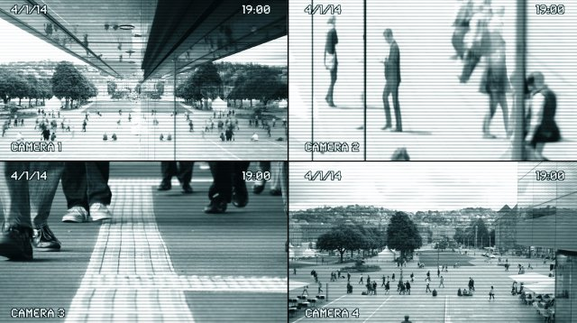

<figure>
    
    <figcaption>Изображение от <a href="https://www.shutterstock.com/g/focusimage" target="_blank_">focusimage</a></figcaption>
</figure>

Сегодня, ни для кого не секрет, что любые системы наружного видеонаблюдения уязвимы. IP-камеры в вашей бухгалтерии и на охраняемом объекте, давно стали одной из множества легкодостижимых целей для злоумышленников и школьной орды. Дело в том, что большинство специалистов в отрасли видеонаблюдения в России не уделяют достаточного внимания безопасности веб-интерфейсов таких устройств, как IP-камера или регистратор. Как показывает практика – очень зря.
<!--more-->

<h2>Парсим IP-камеры</h2>
На поиск потенциально уязвимых интерфейсов иногда уходят целые сутки. Для того, чтобы получить доступ к какой-либо IP камере, необходимо задать диапазон, в котором мы будем работать.

С поиском устройств видеонаблюдения нам поможет Advanced IP Scanner. Неплохая (очень даже стабильная) и актуальная программа под Windows умеет сканировать все необходимое.

Мы можем просканировать любой диапазон адресов, это может быть подсеть вашего компьютера или любая другая локальная сеть. Но нас интересуют веб-камеры из интернета.

Поэтому для поиска веб-камер нужно воспользоваться поисковой системой <a href="https://www.shodan.io" rel="nofollow">Shodan</a>. Она, как будто, специально для этого предназначена. Регистрируемся, буквально два клика, и ищем необходимые нам: города и модели необходимых устройств. В поисковой выдаче находим все необходимое для получения доступа к видеонаблюдению. Остается только подобрать пароль или использовать эксплоит для получения пароля. Обратите внимание, что у каждого российского провайдера в регионе можно подобрать необходимый диапазон адресов для взлома.

Итак, необходимый диапазон для работы найден, можно приступать к поиску доступных камер.

<h3>Взлом пароля от IP камеры</h3>
На самом деле, все очень просто. Добрая часть доступных интерфейсов, абсолютно не защищены. При подключении к видеоустройству, мы попадаем на авторизацию. Обычно, связка логин:пароль, смешна до жути и выглядит примерно так:
<blockquote>
<li>admin:</li>
<li>admin:admin</li>
<li>admin:qwerty123</li>
<li>administrator:123456780</li>
</blockquote>

<h5>Типичный интерфейс</h5>

То есть, без использования софта для подбора паролей, простым перебором из этих незамысловатых комбинаций, мы получаем доступ к видеонаблюдению в парках, офисах, барах, магазинах и других общественных мест. Более того, если устройство обладает неплохой железной составляющей, мы получаем доступ не только к картинке, но и звуку, а также в некоторых случаях, можем полностью управлять процессом видеонаблюдения и записи.

Для простого просмотра большинства камер D-Link (например, модель DSC-2130), можно использовать связку из логина и пароля - guest:guest
Модели устройств видеонаблюдения D-Link очень легко гуглятся и доступны каждому.

Подобрать пароль с помощью брута можно с помощью скрипта hydra. Как-то раз я рассказывал, что с помощью него можно <a href="http://themaestro.ru/security/brute-e-mail-accounts/">вспомнить забытый пароль от почтового ящика</a>. И вот, снова он, выручает нас. Как это выглядит? Все очень просто.
Открывает консоль в Kali Linux и запускаем, примерно вот такую команду (предварительно составив необходимые списки для подбора: айпи и пароль к ним):

Флаги из команды довольно просты для понимания:
-l это логин
-P список паролей в формате .txt
-o список подобранных паролей (именно там будут хранится удачные связки IP:пароль)
-M список IP-камер в формате .txt, в виде обыкновенного IP.

Для того, чтобы расширить познания в скрипте hydra, можно воспользоваться справкой.

<h4>Взлом IP камеры с помощью эксплоита</h4>
Более сложный вариант взлома ip камеры – использование специального эксплоита. Как многим известно, найти его для всего на свете можно найти в <a href="https://www.exploit-db.com/" rel="nofollow">самой большой базе эксплоитов в интернете</a>.  Если обычные методы подбора пароля не помогают, приходится искать эксплоит под устройство, к которому вы желаете получить доступ.
